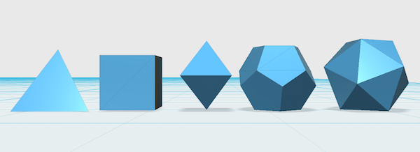

psg-stl
-------

A little python script to generate STL models of the five platonic solids.

## The solids

### Tetrahedron

Simple enough but proved a pain in the arse to orientate to Z-up base-plane. The solution was simple enough: translate first and rotate second.

Coordinates are:

	( ±1,  0, −1/√2 )
	(  0, ±1,  1/√2 )

### Cube (Hexahedron)

Everyone knows what a cube is right?!

	( ±1, ±1, ±1 )

### Octahedron

A pretty simple little number. The vertices making up this solid are as follows:

	( ±1,  0,  0 )
	(  0, ±1,  0 )
	(  0,  0, ±1 )

Because this solid would not 3D print very well, use the `--split` argument to slice this solid horizontally at the centre. Print 2 duplicates out and glue them together.

### Dodecahedron

[This article on Wikipedia](https://en.wikipedia.org/wiki/Dodecahedron) describes the coordinates of the dodecahedron. The vertices are formed as follows:

	( ±1,   ±1,   ±1   )
	(  0,   ±1/φ, ±φ   )
	( ±1/φ, ±φ,    0   )
	( ±φ,    0,   ±1/φ )

	φ = (1 + √5) / 2 (the golden ratio)

The following image displays the vertices, as well as the indices:

### Icosahedron

[Wikipedia again describes the Icosahedron](https://en.wikipedia.org/wiki/Regular_icosahedron) and the vertices are formed as follows:

	(  0, ±1, ±φ )
	( ±1, ±φ,  0 )
	( ±φ,  0, ±1 )

	φ = (1 + √5) / 2 (the golden ratio)

Instead of calculating indices with the help of a diagram, I instead decided to ‘lift’ the calculated vertices and indices from [Andreas Kahler’s blog](http://blog.andreaskahler.com/2009/06/creating-icosphere-mesh-in-code.html). Apologies for cheating.
