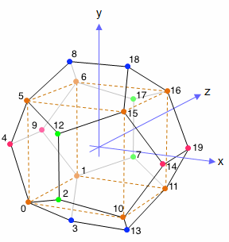

psg-stl
-------

A little python script to generate STL models of the five platonic solids.

## The solids

### Dodecahedron

[This article on Wikipedia](https://en.wikipedia.org/wiki/Dodecahedron) describes the coordinates of the dodecahedron. The vertices are formed as follows:

	( ±1,   ±1,   ±1   )
	( 0,    ±1/φ, ±φ   )
	( ±1/φ, ±φ,   0    )
	( ±φ,   0,    ±1/φ )

The following image displays the vertices, as well as the indices:

